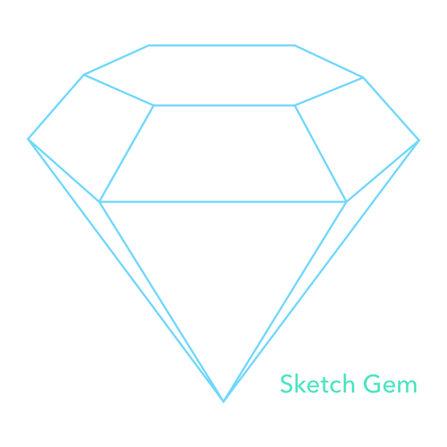
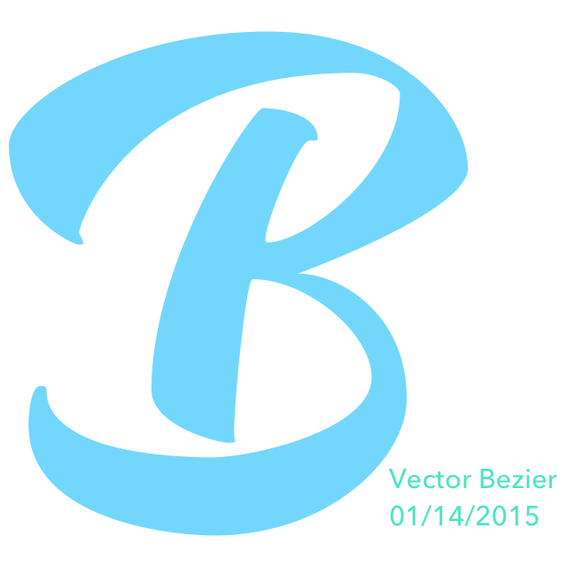
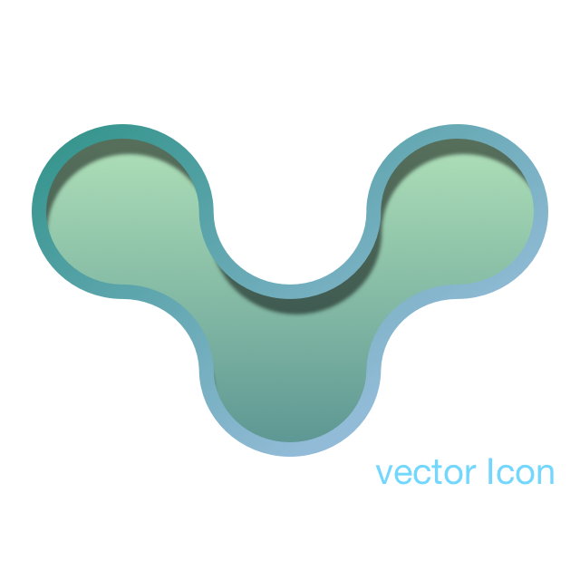
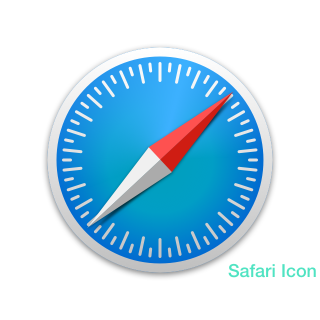
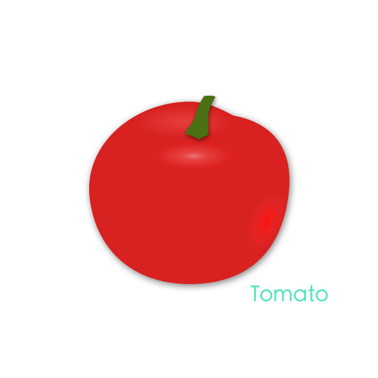
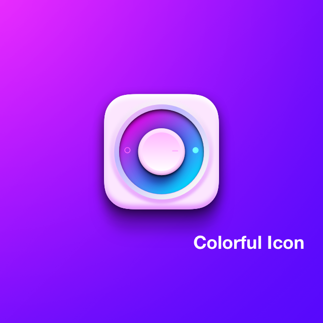
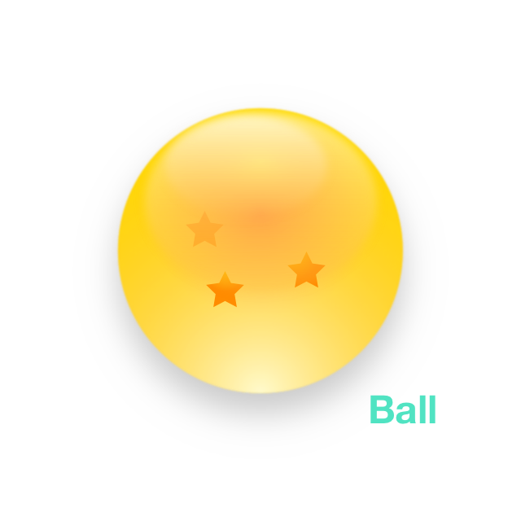
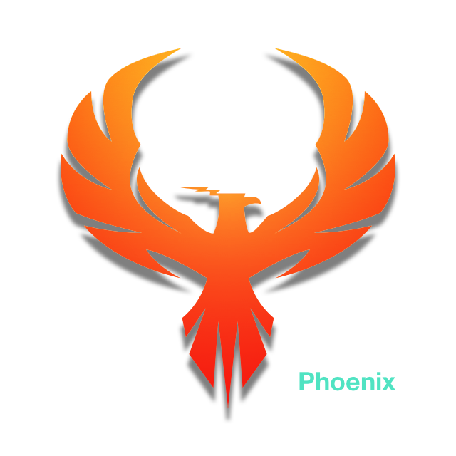

# Design practice with Sketch3
one icon one day made by Sketch3.

---
Source File is in the related subdirectory.

#### Day 1: Gem (01/13/2015)

#### Day 2: Vector Point Placement (01/14/2015)

#### Day 3: Vector Icon (01/26/2015)

#### Day 4: Safari Icon (01/28/2015)

#### Day 5: Tomato (01/29/2015)

#### Day 6: Colorfulicon (01/30/2015)

#### Day 7: Ball (01/31/2015)

#### Day 8: Phoenix from PirateBay(02/1/2015)

#### Day 9: Pencil(02/2/2015)

